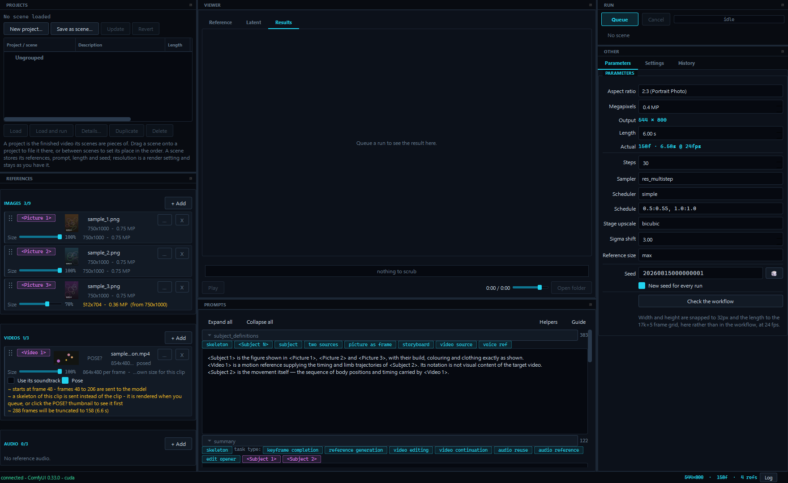
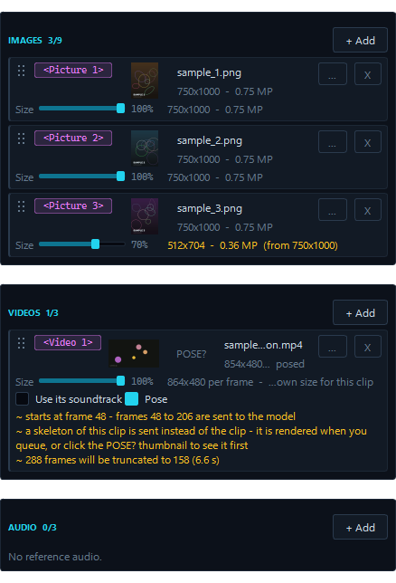
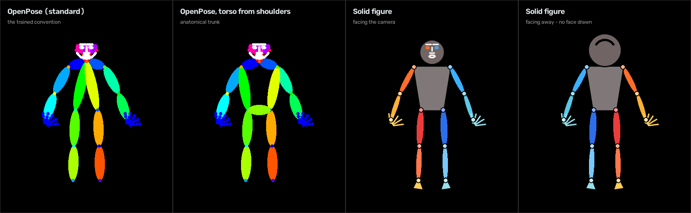
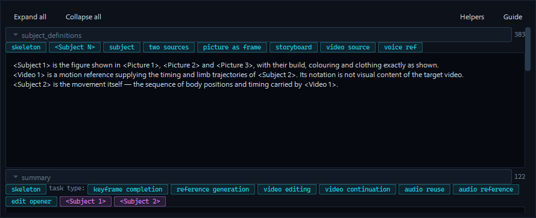
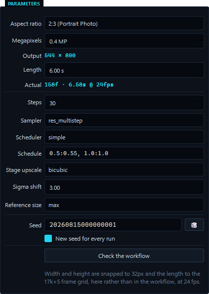

# HARMON3

A desktop front-end for the MiniMax H3 reference-to-video workflow in
`API/video_minimax_h3_r2v_api.json`. It drives a running ComfyUI over its HTTP and
WebSocket API and exposes only the controls that matter for this model: reference images,
videos and audio; the prompt; and the generation parameters. Everything else — frame rate,
codec, output prefix — stays exactly as the workflow defines it.

ComfyUI supplies every generation model. The only weights HARMON3 fetches for itself are
the pose estimator's, and only if you use the optional Pose feature.

It finds the nodes it drives by a **role tag** at the start of each node's ComfyUI title —
`h3-promptinput`, `h3-loadmodel`, `h3-vidcombine`. Node numbering belongs to ComfyUI, so
the workflow can be renumbered, rewired and extended without touching any code. See
[Modifying the workflow](#modifying-the-workflow).



*References on the left with their prompt tags, the viewer and prompt editor in the middle,
parameters and run controls on the right. Every screenshot here uses synthetic placeholder
media.*

---

## Requirements

**Locally:** Windows, Python 3.12 (`py -3.12`), and a reachable ComfyUI. Pose estimation
additionally wants an NVIDIA GPU; it falls back to CPU and says which it used.

**On the ComfyUI server** — `python -m harmon3 --check` reports anything missing before a
run rather than during one.

| Custom node pack | Provides |
|---|---|
| [ComfyUI-Hillobar](https://github.com/Hillobar) | `MiniMaxH3ProgressiveSampler` |
| [ComfyUI-VideoHelperSuite](https://github.com/Kosinkadink/ComfyUI-VideoHelperSuite) | `VHS_LoadVideo`, `VHS_VideoCombine` |
| [ComfyUI-KJNodes](https://github.com/kijai/ComfyUI-KJNodes) | `ModelPreviewOverrideKJ`, `PathchSageAttentionKJ` |

Everything else is core ComfyUI, including `MiniMaxH3ReferenceToVideo`,
`MiniMaxH3SigmaShift` and the `ComfySwitchNode` behind the Sage toggle.

Model files, under ComfyUI's usual folders. The workflow names these and any of them can be
repointed in ComfyUI without touching this app:

```
unet/minimax_h3/minimax_h3_ref2va_pruned_int8_convrot.safetensors
clip/qwen/qwen3vl_32b_minimax_h3_nvfp4_awq.safetensors
vae/minimax_h3/minimax_h3_video_vae_fp16.safetensors      (video)
vae/minimax_h3/minimax_h3_audio_vae_fp32.safetensors      (audio)
```

Sage Attention is optional and off unless switched on; it needs the `sageattention` library
where ComfyUI runs.

## Setup

```
setup.bat        creates .venv with Python 3.12 and installs the dependencies
run.bat          launches the app
run_debug.bat    launches with a console and verbose logging
```

The default server address is `http://127.0.0.1:8188`; change it with **Server...** in
Settings.

If you use Pose, the first run of it downloads ViTPose (~1.2 GB) and its YOLOX person
detector (~351 MB) from HuggingFace. The estimator lands in `models/pose/`, the detector in
`~/.cache/rtmlib`. Nothing else is downloaded at any point.

---

## Using it

### References

Up to **9 images, 3 videos and 3 audio files**, added with *+ Add* or dropped onto the
reference panel. Each row shows the tag the model uses for it — `<Picture 1>`, `<Video 1>`,
`<Audio 2>` — and clicking a tag inserts it into the prompt at the cursor. Reference videos
have a *use its soundtrack* checkbox that sends their audio alongside their frames.

**The order is the numbering.** The model assigns ordinals purely from the order and kind of
what it receives: every image, then each video with its soundtrack's `<Audio j>` emitted
immediately *before* its `<Video k>`, then every standalone audio.

```
<Picture 1>  <Picture 2>  <Audio 1>  <Video 1>  <Audio 2>
                          ^ the video's soundtrack   ^ the standalone audio
```

Drag a row by the grip on its left to reorder it, within its own kind. Reordering, removing
a reference or unticking a soundtrack all **renumber the tags** — so the app watches for it
and offers a one-click *Rewrite tags in prompt*, which substitutes every tag simultaneously
so swaps and cycles cannot cascade.

**Size ceiling.** Every image and video row carries a *Size* slider, 100% down to 10%,
deciding how much of that reference is sent. Reference tokens ride through every sampling
step, so a smaller reference is a faster run at some cost in fidelity. It works because the
model never *enlarges* a reference, so shrinking one here is a ceiling it will not raise.
The readout beside the slider always says what will actually be sent.

- An **image** is a share of its own file.
- A **clip** is a share of the ~1344×768 canvas the model fits every clip to. A share of
  the file would be meaningless — a 4K source and a 1080p one are flattened onto that same
  canvas before anything is encoded. A clip already smaller than it says so, and its slider
  does nothing.

Your files are never modified. A resized copy is prepared before the run and swapped in on
the way to the server, so the row, your scenes and your settings always name the original.



*Each row states what will actually be sent. `<Picture 3>` is capped at 70%, so it reads
`512x704 - 0.36 MP (from 750x1000)`. The video row is marked at frame 48 and set to Pose,
so it says which frames go and that a skeleton goes in place of the clip.*

### Marking the section

Click a reference and it opens in the result frame with the timeline under it, **paused on
its first frame**. The in point you set there is where the section the model receives
begins.

There is **no out point**: the model truncates every reference to the generated length, so
the section runs from the mark for exactly as long as the clip being made. The *Duration*
parameter is the out point, and changing it moves the far edge of every section at once.
Nothing is cut on disk — a reference stays its file plus its mark.

| | |
|---|---|
| drag the handle | move the in point |
| drag elsewhere | scrub |
| `I` | mark in at the playhead (needs the timeline focused) |
| ← / → | nudge a frame, shift for ten |
| wheel | step a frame over the picture or the track, ten with shift |
| *Play section* | play what will be sent, on a loop |

### Pose

Tick *Pose* on a video reference and the model receives a skeleton of that clip on black
instead of the clip: the movement without the person. Useful when a reference is there for
how someone moves rather than for who they are.

Estimation happens locally — an ONNX pass over the frames that will actually be sent, run
before the job is queued. The result is an ordinary mp4 that goes through the same upload
path as any other reference, carrying the clip's own audio so a posed reference keeps its
soundtrack and its `<Audio>` tag.

Only the marked section is posed, which is the difference between 124 frames and 6,777.
Renders are cached against the source's contents, the mark and the generated length, so
moving any of those re-renders and touching none of them costs nothing. The thumbnail
beside the source shows the skeleton once there is one; click it to watch, or click it
before there is one to render it there and then.



Settings offers three estimators — **ViTPose-L** (default), **ViTPose-B** (faster, looser)
and **ViTPose-L wholebody** (adds face, hands and feet) — and three drawing styles:

| Style | |
|---|---|
| *OpenPose (standard)* | Both hips hang off the neck. The convention pose-conditioned models are trained on |
| *OpenPose, torso from the shoulders* | Each hip joins its own shoulder and the two hips join each other, so the trunk is a closed shape with width. Anatomical, but no longer the trained convention |
| *Solid figure* | A filled trunk, a real head, black outlines so crossing limbs separate, and warm on the right against cool on the left. It works out which way the subject is facing and draws a face only when there is one to see; with the wholebody model it also draws the feet. For looking at rather than conditioning on |

*Solid figure* exists because a 2D skeleton facing away is very nearly the mirror of one
facing the camera, which makes a rendered clip hard to read. It votes on shoulder, hip and
ear order — plus toe direction and face confidence when the wholebody model supplies them —
smooths the verdict over the clip, and holds its last answer through a profile rather than
flickering. Changing the style discards every rendered clip, since they were drawn the old
way.

### Prompt

Written in six collapsible sections — `subject_definitions`, `summary`,
`retention_analysis`, `detailed_description`, `overall_soundscape`, `non_diegetic_music` —
joined into the one string the model receives, in that order. An empty section still
appears carrying `N/A`, so the model always sees the same structure.

Under each open section is a row of **format chips** carrying the output format's own
vocabulary, each chip's caption being the thing it inserts. Every `<Subject N>` your
`subject_definitions` defines also appears as a chip in the other five, live as you type —
the model resolves a label by matching the string, so a mistyped one silently stops
referring to anything. *Helpers* hides the rows; *Guide* opens the format spec beside the
editor.



### Parameters



Computed values are shown live as you type: *Output* is the snapped pixel size, *Actual*
the frame count the model will really receive and what that is in seconds.

| | |
|---|---|
| *Aspect ratio*, *Megapixels* | the pixel dimensions, shown live and snapped to a fixed 32px grid |
| *Length* | the model only accepts frame counts of the form 17k+5 at 24 fps, so the request is rounded **up**. Ceiling 3592 frames — 149.6 s |
| *Steps* | sampling steps. Run time is very nearly proportional to it |
| *Sampler*, *Scheduler* | the list starts as stock ComfyUI's and becomes whatever the connected server offers, so sampler packs show up on their own |
| *Schedule* | the staged sampler's progressive-resolution plan, as `scale:end_percent` per stage — `0.5:0.55, 1.0:1.0` spends the first 55% of the steps at half grid. The last stage must be `1.0:1.0`. Checked as you type. Shown only when the workflow's sampler declares one |
| *Stage upscale* | how the estimate is resampled between staging stages. Does nothing at `1.0:1.0`. Shown and hidden with *Schedule* |
| *Sigma shift* | where the weight of the sigma schedule sits. Higher moves the picture further from the references; lower holds closer. Needs an `h3-shift` node |
| *Reference size* | `ref_image_size`, applied to every reference at once. **match** scales each to the generation's pixel area; **max** uses the 2048px short edge for best fidelity but can be several times slower. Defaults to **max**, since each reference now carries its own ceiling. **Does not apply to reference videos** — those are fitted to a fixed canvas regardless |
| *Seed* | 56-bit, with a dice button and a *New seed for every run* toggle |

*Check the workflow* confirms the role contract still binds, that every node exists on the
connected server, and that nothing needed would be pruned. It loads no models.

### Scenes and projects

A **scene** is a named, reusable shot: its references, prompt, length and seed settings,
plus a description. Save with *Save as scene...*, double-click to load, *Load and run* to
queue it straight away. Each scene is its own file in the scenes folder, so one can be
copied to someone else and a damaged file cannot take the catalogue with it. Resolution,
steps and reference size are deliberately **not** part of a scene — they are render
settings, so the same scene runs small while you iterate and full size when you are happy.

A **project** groups scenes into the finished video they are pieces of, with a running
order and a total. Drag a scene onto a project to file it. Deleting a project never deletes
a scene; membership travels on the scenes themselves.

### Running

*Queue* stays available while a run is going, so you can change anything and queue the next
one straight away — each press snapshots the editor as it stands. *Cancel* takes the
**oldest** outstanding run, so pressing it repeatedly clears a batch in submission order; a
run the server has already begun is interrupted, one still waiting is deleted from the
queue without touching whatever is executing.

The clip being sampled animates in the result frame step by step, via KJNodes' preview
node. The progress bar reads `sampling 13/20 48s left`. Finished videos are downloaded to
`runs/videos/`, played in the app with audio, and recorded in `runs/runs.jsonl` — each
history entry stores the exact graph submitted, so *Re-queue* resubmits it verbatim.

**Diagnostics → Export references** writes out exactly what the model is about to be given,
into `reference_bundle/`: the files as they will be uploaded — after any section cut,
skeleton, resize or rotation — named for the tag that addresses them, the prompt as the
node receives it, and a `manifest.json` saying what the node then resizes each one to and
what that costs in tokens. For the question that comes up whenever a result looks wrong:
*what did it actually see?*

---

## Modifying the workflow

Every node the app drives carries a role tag as the first word of its ComfyUI title. The
rest of the title is yours — `h3-promptinput Input Text` tags the node and still reads like
a name. Re-export with **Export (API)** as usual.

`python -m harmon3 --roles` shows what bound to what. Startup refuses a workflow that breaks
the contract and lists **every** problem at once rather than one per launch.

**Required**, one node each:

```
h3-promptinput  h3-reference  h3-loadmodel  h3-loadclip  h3-loadvideovae
h3-loadaudiovae  h3-sampler  h3-scheduler  h3-vidcombine
```

**Required as a pair — at least one of** `h3-progressivesampler` or `h3-noise`, because the
seed has to go somewhere. `MiniMaxH3ProgressiveSampler` carries its own `noise_seed` and a
`schedule`; `SamplerCustomAdvanced` takes its noise by link, so that arrangement needs a
`RandomNoise` tagged `h3-noise`. Either works and the app adapts.

**Optional** — absent simply means the feature or caption is: `h3-sampleradvanced`,
`h3-guider`, `h3-shift`, `h3-imagedecode`, `h3-audiodecode`, `h3-preview`, `h3-sage`,
`h3-switch`, and `h3-refimage` / `h3-refvideo` for loaders whose filenames seed the
reference list on a first launch.

`h3-keep` is not a role. It marks a node as a root the orphan sweep starts from, which is
how a branch of your own — a second output, a preview — survives a build.

**Free to change:** node numbering and layout; untagged nodes anywhere in the model chain
(a LoRA loader, a model patch); side branches, as long as something in each is tagged
`h3-keep`; and any widget the app does not write — model filenames, the output node's
prefix, format and codec.

**Changes only until the first launch:** the exposed parameters, the prompt and the Sage
switch. These are read from the workflow to seed `settings.json`, which owns them
afterwards.

**Not free:** removing a required role, putting one tag on two nodes, or changing a role
node's class to one outside its accepted set — all three are refused at startup with the
reason. And changing the output node's `frame_rate` without changing `config.FPS`: nothing
links the two, so every clip would render at the wrong length without failing. *Check the
workflow* and `--roles` both warn about that one.

### What the app writes into the graph

The workflow JSON itself is never modified; every build deep-copies it. Width, height and
length are computed here and written into `MiniMaxH3ReferenceToVideo` as literals —
dimensions snapped to a multiple of 32, the frame count rounded up to the next 17k+5 the
model accepts — because the workflow carries no node that does that arithmetic.

Reference loaders are injected and wired to the node's flattened autogrow keys
(`ref_images.ref_image_0..8`, `ref_videos.ref_video_0..2`,
`ref_video_audios.ref_video_audio_0..2`, `ref_audios.ref_audio_0..2`). Reference files are
uploaded into an `input/harmon3/` subfolder under a name carrying the file's SHA-256, so
re-submitting the same reference never re-uploads it. Nodes nothing consumes are left out of
the submitted graph and named in the log.

---

## Command line

```
.venv\Scripts\python -m harmon3 --dry-run --diff    the graph, diffed against the workflow
.venv\Scripts\python -m harmon3 --check             validate against the server's schemas
.venv\Scripts\python -m harmon3 --roles             which node plays which role
.venv\Scripts\python -m harmon3 --object-info       dump the node schemas this app uses
.venv\Scripts\python -m harmon3 --upload-test FILE  upload and retrieve a file
.venv\Scripts\python -m harmon3 --pose CLIP --out P.mp4 --start 1356 --frames 124
                                                    render one skeleton, no server needed
.venv\Scripts\python -m pytest tests -q             unit tests
```

`--dry-run --diff` on a freshly launched app reports only the intended differences: the
prompt, assembled from the six sections rather than sent bare, and the reference node's
width/height/length, computed here. Every other node must match exactly.

---

## Notes

- Generated state lives beside the app and is not tracked in git: `settings.json`,
  `ui_state.ini`, `scenes/`, `runs/`, `reference_bundle/` and the downloaded pose weights in
  `models/`. All of it regenerates. Set `HARMON3_HOME` to relocate it.
- **Reference video is the most expensive input** — its latents are carried through every
  sampling step. Long reference videos are the usual cause of an out-of-memory failure.
- Reference video is assumed to be 24 fps and is not resampled; the app warns when a
  source's frame rate differs.
- **Pose follows one subject.** The largest detection wins and continuity keeps it from
  hopping to a passer-by; a reference with two people in it loses one.
- A workflow carrying `h3-refimage` / `h3-refvideo` loaders seeds the reference list from
  their filenames on a first launch. If those files are not in ComfyUI's `input` folder the
  app flags the rows and blocks the queue rather than letting the submit fail. The shipped
  workflow carries none.
- **ComfyUI has no authentication.** If it was started with `--listen` it is reachable from
  the local network; HARMON3 itself only talks to the address you configure.
